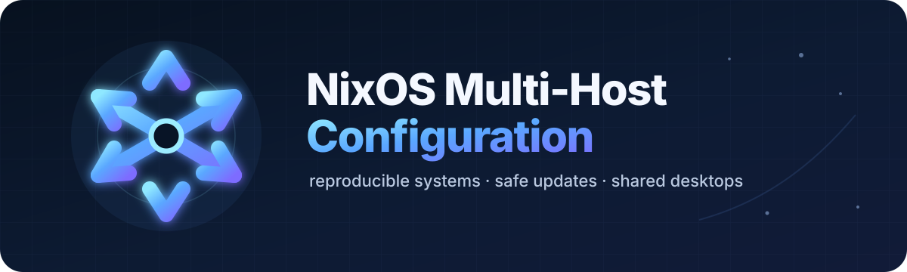

<p align="center">
  
</p>

<p align="center">
  
  
  
  
</p>

<p align="center">
  Reproducible NixOS systems for two machines, with safe installation, transactional updates, shared desktop configuration, and local hardware protection.
</p>

## Systems

| Host | Hardware | Optimization | Desktop profile |
|---|---|---|---|
| `nyx` | AMD desktop | `znver4` | Mango + Niri |
| `aether` | Intel/NVIDIA laptop | `x86-64-v3` with NVIDIA PRIME | Mango + Niri |

Each host also provides dedicated Mango-only and Niri-only profiles.

## Highlights

- Multi-host NixOS flake with shared modules and host-specific hardware definitions
- Mango and Niri sessions with Noctalia, Noctalia Greeter, and Home Manager
- CachyOS kernel integration with a configured binary cache
- Native Flatpak integration
- Safe local handling of `hardware-configuration.nix`
- Build-before-switch installation and update flow
- Automatic lock-file recovery when an input update or build fails
- LUKS tuning and a one-time TRIM pass after successful system changes
- Manual, versioned synchronization for Mango, Niri, and Noctalia dotfiles
- System rollback and configuration recovery commands
- Companion application catalog through [`madebycli/nix-pkgs`](https://github.com/madebycli/nix-pkgs)

## Fresh installation or reinstall

Start from a normal minimal NixOS installation with networking, Git, Nix, `sudo`, and `/etc/nixos/hardware-configuration.nix` available. The installer currently expects the configured user account to be named `xxxxx`.

### Nyx

```bash
nix run --refresh github:madebycli/nix-config#install -- --nyx
```

### Aether

```bash
nix run --refresh github:madebycli/nix-config#install -- --aether
```

The default profile enables both Mango and Niri. Add `--mango`, `--niri`, or `--both` to select a desktop profile explicitly.

The installer:

1. clones or safely fast-forwards the correct host repository;
2. refreshes the local flake inputs;
3. copies the machine's current hardware configuration;
4. protects that file from normal Git synchronization;
5. builds the selected NixOS profile;
6. switches only after a successful build;
7. initializes the managed dotfiles;
8. schedules a one-time TRIM pass for the next boot.

## Update everything

```bash
system-update
```

`system-update` refreshes every flake input declared by this configuration, builds the active host profile, switches only after a successful build, and restores the previous `flake.lock` if the update fails.

Pull newer configuration code from GitHub without changing the input set:

```bash
config-update
```

Return to the previous NixOS generation:

```bash
system-rollback
```

## Application catalog

Desktop applications and terminal tools maintained outside this system configuration are collected in [`madebycli/nix-pkgs`](https://github.com/madebycli/nix-pkgs).

Add one catalog package:

```bash
nix profile add github:madebycli/nix-pkgs#<package>
```

Update every package in the current Nix profile:

```bash
nix profile upgrade --all --refresh
```

Profile-managed packages and system-managed flake inputs are separate update paths. `system-update` updates this NixOS configuration; `nix profile upgrade --all --refresh` updates standalone profile packages.

## Desktop profiles

| Profile | Nyx | Aether | Sessions |
|---|---|---|---|
| Default | `nyx` | `aether` | Mango + Niri |
| Mango | `nyx-mango` | `aether-mango` | Mango only |
| Niri | `nyx-niri` | `aether-niri` | Niri only |

The most recently activated profile is remembered by the local tooling and reused by normal updates.

## Configuration tools

| Command | Purpose |
|---|---|
| `config-update` | Pull configuration changes, build, and optionally activate them |
| `system-update` | Update all declared flake inputs, build, switch, and publish a safe lock-file update when possible |
| `system-rollback` | Switch to the previous NixOS system generation |
| `config-sync` | Compare, pull, push, or synchronize managed configuration files |
| `save-config` | Save selected local configuration changes into the repository mirror |
| `script-update` | Review and replace maintained helper scripts safely |

Managed user configuration currently covers:

```text
~/.config/mango
~/.config/niri
~/.config/noctalia
```

## Hardware and update safety

Real hardware files are never sourced from GitHub during installation. The installer copies `/etc/nixos/hardware-configuration.nix` into the selected host directory and marks the tracked placeholder as `skip-worktree` locally.

System changes follow the same safety model throughout the repository:

- validate the expected repository and remote;
- refuse unsafe or diverged Git states;
- preserve local hardware data;
- build before switching;
- restore the previous lock file after failed input updates;
- avoid switching after a failed build;
- keep timestamped local backups where replacement is necessary.

## Repository layout

```text
flake.nix                 host profiles, applications, and update tools
hosts/                    nyx and aether definitions
modules/nixos/            shared NixOS modules
modules/home/             Home Manager configuration
modules/flatpak/          Flatpak integration
scripts/                  installer, updater, rollback, and sync tools
sync/                     managed path declarations
config/home/              versioned user-configuration mirror
```

This repository contains personal machine configuration. Host-specific hardware data, generated system state, credentials, and private user data must remain local.
